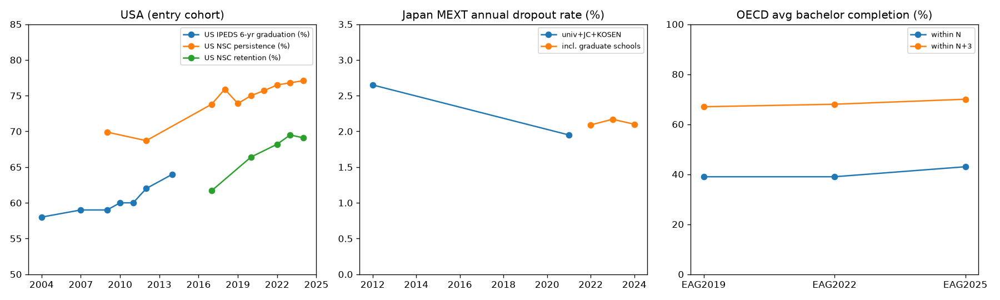

# 大学中退（ドロップアウト）の国際比較と中退予防研究のまとめ

作成日: 2026-09-24

## このフォルダの中身

| ファイル | 内容 |
|---|---|
| `README.md` | 全体のまとめ（本ファイル） |
| `01_global_statistics.md` | 世界の中退率・修了率の詳細調査（OECD・米国・英国ほか。出典URLと定義つき） |
| `02_japan_data_practice.md` | 日本の中退データ（文科省調査の推移・理由別）、修学支援新制度、大学IRの実践例、国内研究 |
| `03_literature_annotated.md` | 中退・継続・予防研究の注釈つき文献リスト（98件。理論／レビュー／RCT／予測・公平性／日本） |
| `bibliography.csv` | 上の文献リストの機械可読版（DOI、OA URL、OA状況） |
| `dropout_timeseries.csv` | 各国の時系列の数値（検証状況 `status` と出典URLつき） |
| `dropout_timeseries.png` / `plot_timeseries.py` | 主要な時系列のグラフと、その作図スクリプト |
| `fetch_papers.py` | オープンアクセス論文の一括ダウンロードスクリプト |

### 論文PDFについて（重要）
この作業環境はネットワークが制限されていて、論文サイト（NBER、ERIC、MDRC、J-STAGE、Unpaywall など）に接続できませんでした。そのため、**PDFはここには入っていません**。
代わりに `bibliography.csv` に98件の書誌情報とOA URL（72件）をまとめました。**インターネットにつながるPCで次のコマンドを実行すると、取得できる論文を `papers/` に一括ダウンロードできます**。

```bash
pip install requests
python fetch_papers.py --email あなたのメールアドレス
```

- `oa_url` があればそこから取得します。なければDOIをUnpaywallで照会し、OA版を探します。
- 結果は `papers/download_log.csv` に記録されます（取得済み／OAなし／失敗）。
- `oa_status` の内訳は、OA 約60件、有料（paywalled）約20件、要確認 約15件です。有料の論文は大学図書館経由で入手してください。

### 数値の信頼度表示
- **V**: 検索結果で出典とともに確認できた値。
- **V?**: 出典の確認があいまいな値。
- **UNVERIFIED／要確認**: 背景知識のみ、または二次情報だけの値。

一次資料（PDF本文）とは照合できていません。対外資料に使う前に、表中のURLで必ず確認してください。

---

## 1. 世界の中退率・修了率：現状と推移



### 1-1. OECD平均（学士課程入学者の修了率、EAG指標B5）

| EAG版 | 標準年限内 | 標準年限＋1年 | 標準年限＋3年 | 高等教育から離脱 |
|---|---|---|---|---|
| 2019 | 39% | – | 67% | 2年次開始までに12% |
| 2022 | 39% | – | 68% | – |
| **2025（最新）** | **43%** | **59%** | **70%** | 標準年限終了時点で**20%** |

- 2025年版の内訳（標準年限終了時点）: 学士取得42%、短期高等教育の学位取得1%、**在学継続38%**、**離脱20%**。
- 男女差（2025年版、標準年限＋3年）: 男性63%、女性75%。
- 1年次の離脱率が20%を超える国: ブラジル、コロンビア、ベルギー（仏語圏）、ルクセンブルク、ペルー、ルーマニア。
- 英国は標準年限内修了が67%でトップ級です。オランダは標準年限＋3年で71%。
- 過去の値は定義が異なり（卒業者数÷入学者数の横断比）、そのままつなげられません。EAG2008（2005年データ）のOECD平均の中退率は約31%で、当時は日本が最も低い国とされていました（日本約90%・米国約56%という残存率は要確認）。

### 1-2. 米国

| 指標 | 過去 | 現在 |
|---|---|---|
| IPEDS 6年卒業率（初回・フルタイム・同一機関） | 2004年入学 58% → 2009年 59% | 2014年入学 **64%** |
| NSC 2年次継続率（どこかに在籍） | 2009年入学 69.9% → 2012年 68.7% | 2024年入学 **77.1%**（10年で最高水準） |
| NSC 2年次定着率（同一機関に在籍） | 2017年入学 61.7% | 2024年入学 **69.1%** |
| NSC 6年修了率（どこかで何らかの学位を取得） | – | 2019年入学 **61.1%** |
| Some College, No Credential（在籍歴があり学位のない人） | 2018年 3,600万人 | 2023年 **3,760万人**（生産年齢人口）、全年齢4,310万人 |

注意点:
- 2019年入学コホートはコロナ禍で−2.0ptと過去最大の低下でした。
- NSCは毎年、過去の値を遡って改訂します。2018年コホート前後で算出方法も変わっています。

### 1-3. 英国（HESA、1年次後の非継続率）
- 若年・フルタイム学士: 2013年入学 6.0% → 2014年 6.2% → 2015年 6.4%。3年連続で上昇しました。
- 2019年入学: 5.3%で過去最低（コロナ期）。確度は V? です。
- 現在はイングランドで、OfSの継続率指標（B3）に移っています。

### 1-4. その他の国（すべて要確認）

| 国 | 指標 | おおよその値 |
|---|---|---|
| ドイツ | DZHW 学士課程の中退率 | 約28%（総合大学 約35%、応用科学大学（FH）約20%） |
| フランス | 学士（Licence）の3年以内修了率 | 約30%（4年以内で約40〜45%） |
| オーストラリア | 学士1年次の離学率（調整済み） | 約15% |
| 韓国 | 年間の中途脱落率 | 約5% |
| コロンビア（SPADIES） | 大学のコホート中退率（10学期時点） | 約45% |

### 1-5. 日本（文部科学省「学生の中途退学者・休学者」調査）

| 年度 | 年間中退率 | 主な理由 |
|---|---|---|
| 2007 | 2.41%（要確認） | 経済的理由 14.0% |
| 2012 | **2.65%**（79,311人） | **経済的理由 20.4%**（最多）、転学15.4%、学業不振14.5%、就職13.4% |
| 2021 | **1.95%**（コロナ期） | コロナを理由とする中退は1,937人。学生生活不適応が増加 |
| 2022 | **2.09%**（63,098人）※大学院を含む | 転学・進路変更 17.8%（最多）、不適応・意欲低下 16.8%、経済的困窮 13.1% |
| 2023 | 2.17%（逆算値） | – |
| **2024** | **2.10%**（大学のみでは2.00%、短大3.95%） | **転学・進路変更 22.3%**、不適応・意欲低下 16.3%、就職・起業 14.8%、経済的困窮 13.2% |

- 1学年を4年間追跡した累積の退学率は約7%です（読売「大学の実力」2019、2014年入学者。国立2.9%、公立4.2%、私立8.0%、要確認）。
- 年間中退率を国際比較に使うと過小評価になります。コホート追跡の値と区別してください。
- 構造の変化: **経済的理由（20%）→ 転学・進路変更と不適応・意欲低下が中心**になりました。修学支援新制度（2020年〜）との関係が論点です。
  - GPA下位1/4に該当した受給者は22,322人（11%）。支援の打ち切りは年約1.8万人（要確認）。
  - 相対評価による打ち切りが、逆に中退リスクを高める可能性が指摘されています。

---

## 2. 中退予防研究の流れ

### 第1期：理論モデルの構築（1970〜80年代）
- **Spady (1970, 1971)**: デュルケームの自殺論を応用し、学生と大学の学業面・社会面のシステムとの相互作用で中退を説明しました。
- **Tinto (1975, 1993『Leaving College』)**: 学業的統合と社会的統合が目標とコミットメントを強め、継続につながるというモデル。以後の研究の標準的な枠組みです。
- **Bean (1980)**: 従業員の離職モデルを応用したモデル。**Bean & Metzner (1985)** は社会人などの非伝統的学生を扱いました。
- **Astin (1984)**: 関与（Involvement）理論。**Pascarella & Terenzini (1980)** は統合モデルを実証しました。

### 第2期：批判・統合・エンゲージメント（1990〜2000年代）
- **Tierney (1992)**: 同化を前提とする統合概念を、マイノリティの立場から批判しました。
- **Cabrera et al. (1992, 1993)**: TintoモデルとBeanモデルを統合しました。
- **Braxton et al. (2004)**: 寮生活のある大学と通学制の大学を分けてモデルを修正しました。
- **Kuh et al. (2006)**、**Kuh (2008)**: 学生エンゲージメントとHigh-Impact Practices。
- **Robbins et al. (2004) のメタ分析**: 学業上の自己効力感と達成動機が、高校の成績とは独立に継続を予測することを示しました。
- 欧州: **Yorke & Longden (2004)**、**Thomas (2012, What Works?)** が所属感（belonging）を中心概念にしました。

### 第3期：因果推論（RCT・準実験）による施策評価（2000年代後半〜）

| 施策の類型 | 代表研究 | 結果 |
|---|---|---|
| **包括的支援** | CUNY ASAP（Scrivener 2015、Weiss 2019）、Ohio（Miller 2020） | 3年以内卒業が**+18pt（ほぼ倍増）**、6年で+10pt。最強のエビデンス |
| 経済支援 | Dynarski 2003、Goldrick-Rab 2016、Castleman & Long 2016、Denning 2019 | 必要に応じた給付奨学金は修了を押し上げる（$1,000で+4.6pt）。**給付と非金銭支援の組み合わせ**の方が効果的（Clotfelter 2018） |
| コーチング・ケースマネジメント | Bettinger & Baker 2014、Evans 2020（Stay the Course）、MAAPS 2021 | 継続・修了が改善。緊急支援金だけでは効果なし |
| 心理介入（所属感・マインドセット） | Walton & Cohen 2011、Yeager 2016、Murphy 2020、**Walton 2023（22大学・約2.7万人）** | 低コストで効果あり。ただし**所属の機会が実際にある環境でのみ**効く |
| ナッジ | Castleman & Page 2015、Page & Gehlbach 2017（チャットボット）、**Oreopoulos & Petronijevic 2019**、**Bird 2021** | 小規模では有効。**大規模化すると効果が消える** |
| 学業基準・退学勧告 | Lindo 2010、Arnold 2015、Sneyers & De Witte 2017（オランダBSA） | 中退を**早める**が、残った学生の修了率は上がる |
| カリキュラム構造 | Bailey et al. 2015（Guided Pathways）、Logue 2016（正課併修型の補習） | 補習で足止めされないようにすると単位取得と合格率が向上 |
| レビュー | Valentine 2011、Sneyers & De Witte 2018、HEDOCE 2015、Kehm 2019 | 初年次プログラムの効果は小〜中。欧州で監視体制を持つ国は一部 |

### 第4期：ラーニングアナリティクスと予測、公平性（2009年〜現在）
- 予測モデル: Dekker 2009（EDM）、Purdue Course Signals（Arnold & Pistilli 2012。効果の検証方法には批判あり）、Open Academic Analytics Initiative（Jayaprakash 2014）、MOOC（Kloft 2014）。**Georgia State**（Kurzweil & Wu 2015）は約800の警告指標とアドバイジングを組み合わせ、成功事例として知られます。
- **予測はできても、介入で中退が減るとは限らない**: Dawson 2017、**Plak 2022（オランダのRCTで効果なし）**。
- 公平性: Gardner 2019、Yu, Lee & Kizilcec 2021（保護属性をモデルに入れるべきか）、Bird 2021/2024（人種バイアス）、Kizilcec & Lee 2022、Baker & Hawn 2022、Gándara 2024。
- 説明可能AI（XAI）による個別介入: Nagy & Molontay 2024。オンライン教育の中退: Rahmani 2024。

### 日本の研究の流れ
1. **1980年代**: 丸山（1984）が、退学に大学の環境要因が与える影響を社会学的に分析しました。
2. **2010年代前半（政策課題化）**: NEWVERY『中退白書2010』、文科省の初の全国調査（2014）、読売「大学の実力」での大学別公開が重なりました。計量分析として清水（2013）、姉川（2014）、立石・小方（2016）が出ています。
3. **2016年〜（IRと予測モデル）**: 『大学評価とIR』第5号に、藤原、鎌田・井上、竹橋ほかの論文がまとまって掲載されました。変数はGPA・単位修得・欠席・休学経験です。
4. **2018年〜（機械学習と介入設計）**: 白鳥ら（2018、2020「中退確率の遷移を用いた中退学生の類型化」、2023 アーリーアラート設計）、石川・石本（2023）、金沢工大の大規模AI活用（退学者約2割減）。村澤（2024）は、中退の逐次意思決定モデルを構造推定しました。
5. **今後の課題**: 介入効果の因果的な識別（国内ではRCTや準実験がほとんどない）、修学支援新制度の効果検証、予測モデルの公平性。

---

## 3. 業務（IR実務）の流れ：中退予防のPDCA

国内外の研究と実践例（Georgia State、金沢工大、嘉悦大、京都光華女子大など）から整理すると、次のサイクルになります。

```
① 定義と現状把握 → ② データ統合 → ③ リスク予測・類型化 → ④ 介入設計
        ↑                                                    ↓
⑥ 制度・カリキュラムへの反映 ← ⑤ 効果検証（因果推論） ← 介入の実施
```

| 段階 | やること | 参考になる研究・事例 |
|---|---|---|
| ① 定義と現状把握 | 年間中退率と入学コホートの累積（1年次継続率、4年・6年修了率）の両方を算出。学部・入試区分・属性別に見る。休学・留年・転学を区別する | OECD B5の定義、NSCの persistence／retention の区別、文科省調査の理由区分 |
| ② データ統合 | 入試・高校情報、履修・GPA・単位修得、出席、LMSログ、面談記録、学生調査（所属感・自己効力感）、経済支援の状況を学籍番号でつなぐ | Robbins 2004（心理・社会的要因）、竹橋 2016（GPA・欠席）、金沢工大（約18億件） |
| ③ リスク予測・類型化 | 1年前期末を目安に早期警告を出す。ロジスティック回帰・決定木・勾配ブースティング。中退確率の時系列遷移による類型化。**属性別の誤差（公平性）を点検する** | 白鳥ら 2020、2023、Yu & Kizilcec 2021、Bird 2021 |
| ④ 介入設計 | 類型別に支援を分ける。学業面は補習・学修支援、経済面は給付・緊急支援・修学支援新制度の警告対象者へのフォロー、社会・心理面は所属感介入・ピアサポート・カウンセリング、進路面は転学・進路変更の相談 | ASAP型の包括支援、コーチング、所属感介入、Guided Pathways |
| ⑤ 効果検証 | 可能ならRCT（段階的導入・無作為の案内）、難しければ回帰不連続（RDD）、差分の差分（DID）、傾向スコア。**予測精度ではなく中退の減少で評価する** | Plak 2022、Dawson 2017、Oreopoulos 2019（大規模化で効果が消える） |
| ⑥ 制度への反映 | 初年次教育、カリキュラムの構造化、GPA運用、アドバイザー制度、教職員のFD（研修）。学内への報告とダッシュボード化 | Tinto 2012（Completing College）、Kuh 2008、SPOD研修 |

**研究から得られる実務上の教訓**
1. **初年次、とくに前期**に中退の兆候が集中します（OECDでは離脱者の多くが2年次開始前に離れています）。
2. **予測だけでは中退は減りません**。介入の中身と、担当者が実際に動ける体制がないと効果が出ません。
3. **単発の施策より包括型**の方が効果が大きい（ASAP）。
4. **ナッジは大規模化すると効果が薄れます**。個別化と人による支援を組み合わせる必要があります。
5. 所属感介入は、**その学生が実際に所属できる環境**があって初めて効きます。
6. 予測モデルは**公平性の点検とスティグマへの配慮**が必須です（学生に「リスク」というラベルを伝えない、など）。

---

## 4. 残っている課題（次に確認すべきこと）
- 検索回数の上限に達したため、未確認の数値が残っています。
  - ドイツ、フランス、豪州、韓国などの時系列
  - OECD B5の日本の値
  - 文科省R5年度の人数
- `bibliography.csv` で `verify` となっている書誌（とくに日本の文献の著者・年）。
- 文科省PDF、OECD EAG本体、DZHWなど一次資料との照合。
